# 📈 Stock Marketplace System

A full-stack stock marketplace platform built using the **MERN stack** that allows users to view stock data, analyze performance with charts, and perform secure buy/sell transactions. The system differentiates between public users and authenticated users, ensuring a smooth and role-specific experience.

---

## 🚀 Features

- 🔐 **User Authentication & Authorization** using **Passport.js**  
- 👥 **Public Users** (unauthenticated) can access:  
	- About Page  
	- Products Section  
	- Pricing Details  
- 👤 **Authenticated Users** can:  
	- View **live stock data**  
	- **Buy and Sell** stocks  
	- Analyze stock performance via **interactive charts** (Chart.js)  
- 🧪 **Automation Testing** using **Jest** for both backend logic & React components  

---

## 🛠️ Tech Stack

- **Frontend:** React.js, Chart.js  
- **Backend:** Node.js, Express.js  
- **Database:** MongoDB Atlas  
- **Authentication:** Passport.js  
- **Testing:** Jest  

---

## 📂 Project Structure

Stock-Market-main/
│── backend/           # Express.js server, APIs, authentication logic
│   ├── index.js
│   ├── package.json
│   ├── model/         # MongoDB models
│   ├── schemas/       # Mongoose schemas
│
│── dashboard/         # React.js dashboard frontend
│   ├── src/
│   ├── public/
│   └── package.json
│
│── frontend/          # React.js landing page frontend
│   ├── src/
│   ├── public/
│   └── package.json
│
│── Screenshots/       # Project screenshots
│   ├── BuyandSell.png
│   ├── Dashboard.png
│   ├── Funds.png
│   ├── Holdings.png
│   ├── Orders.png
│   ├── Position.png
│   ├── Pricing.png
│   └── Support.png
│
└── README.md

---

## ⚙️ Installation & Setup

### 1️⃣ Clone the repository
```bash
git clone https://github.com/your-username/stock-marketplace.git
cd stock-marketplace
```

### 2️⃣ Install dependencies
**Backend:**
```bash
cd backend
npm install
```
**Frontend:**
```bash
cd frontend
npm install
```

### 3️⃣ Set up environment variables
Create a `.env` file in the backend folder:
```ini
MONGO_URI=your-mongodb-atlas-uri
SESSION_SECRET=your-secret-key
```

### 4️⃣ Run the project
**Backend:**
```bash
npm start
```
**Frontend:**
```bash
npm run dev
```

### 🧪 Testing
Run Jest tests for backend & frontend:
```bash
npm test
```

---


## 📸 Screenshots

### 🏠 Home Page
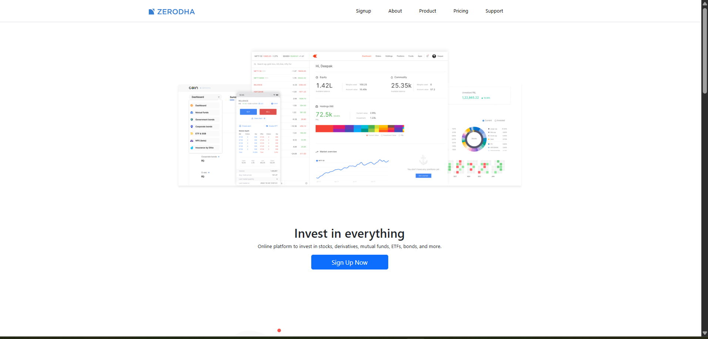

### 📊 Dashboard
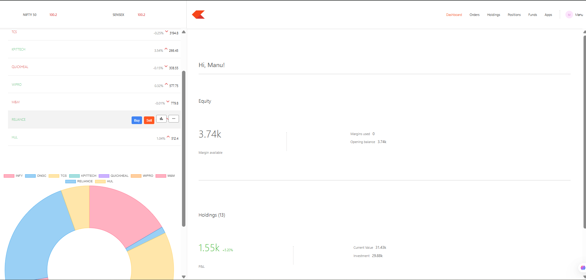

### 🔑 Login Page
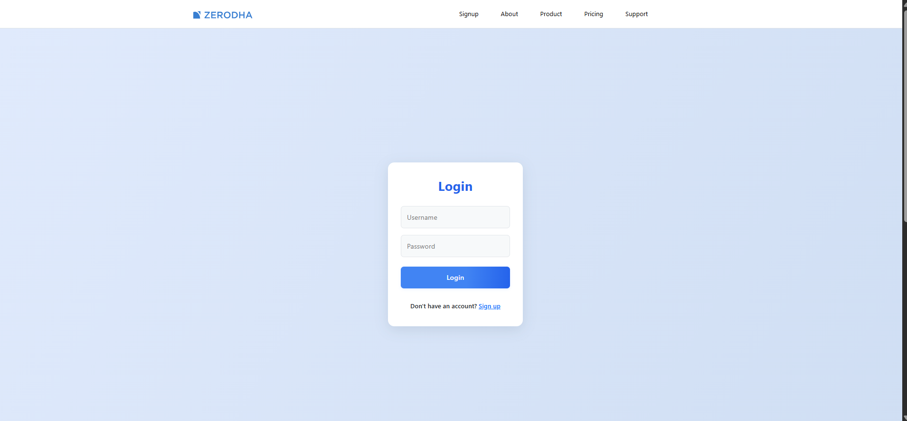

### 📝 Sign Up


### 💰 Funds
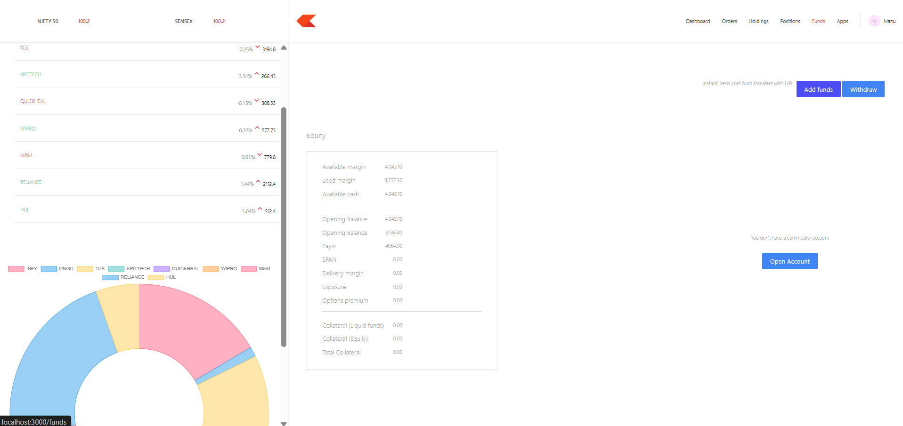

### 📋 Holdings
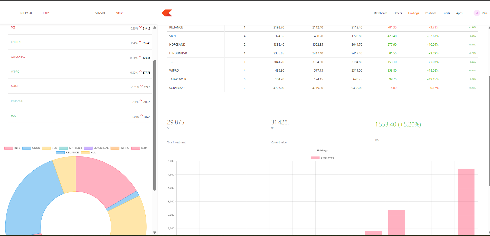

### 📦 Orders
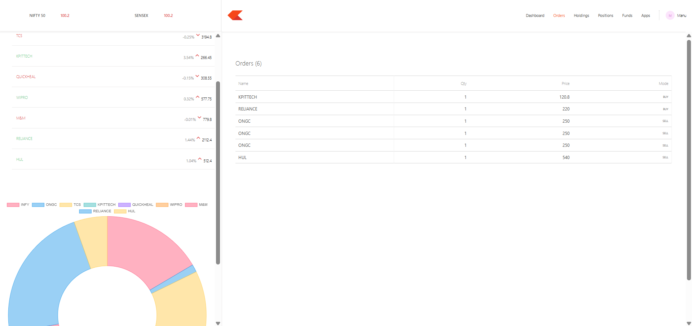

### 📈 Position
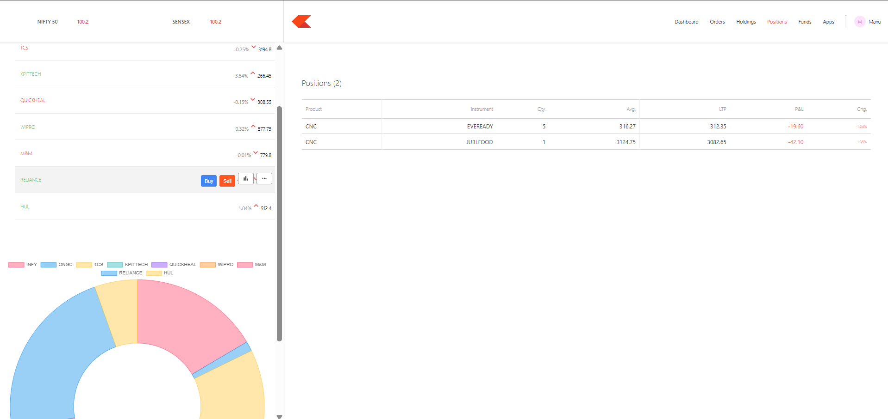

### 💸 Pricing
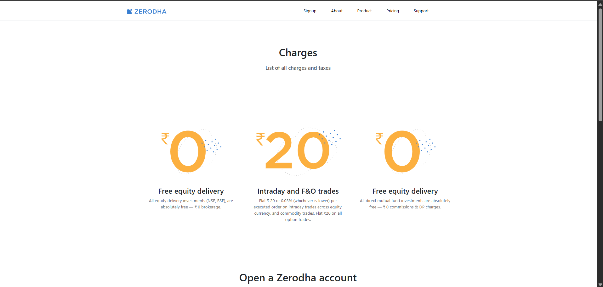

### � Products
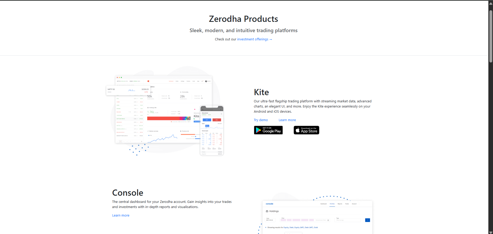

### ℹ️ About
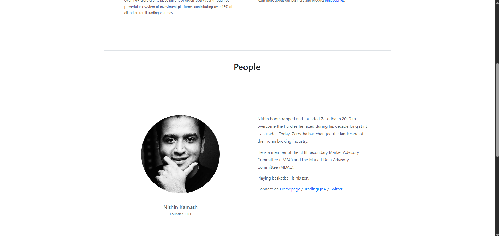


### 🛠️ Support
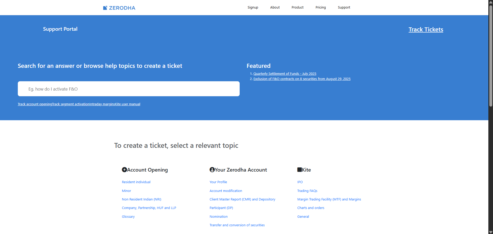

### 🏷️ Buy and Sell
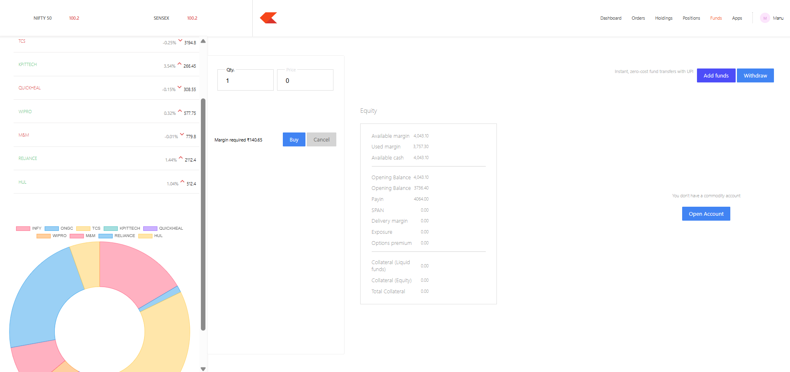

---


## 🤝 Contributing
Fork the repo

Create a new branch (feature/xyz)

Commit your changes

Open a pull request

---

## 📜 License
This project is licensed under the MIT License.

---

## 👨‍💻 Author
Developed by Anuj Awasthi ✨
